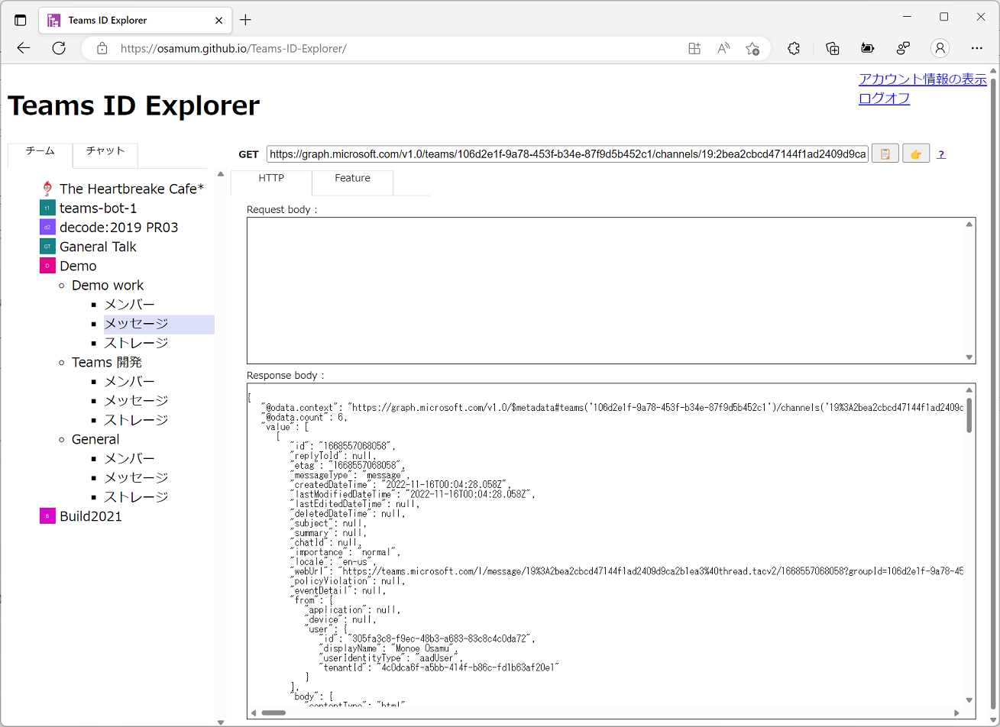
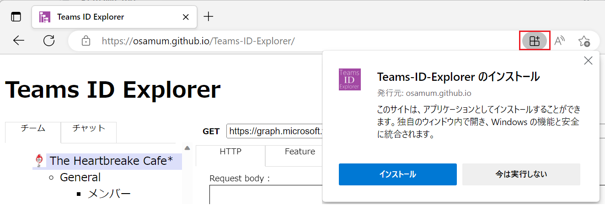
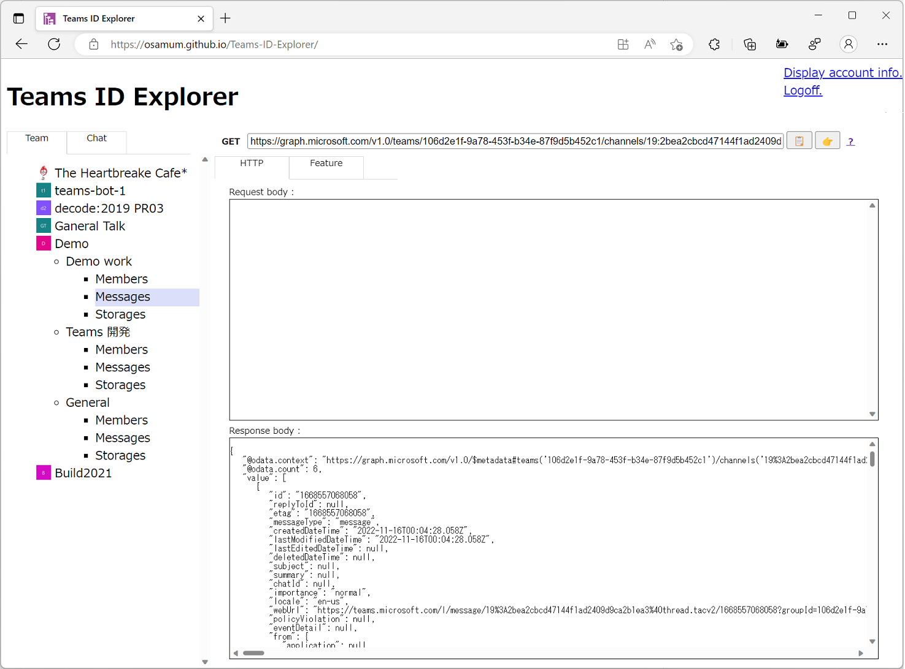
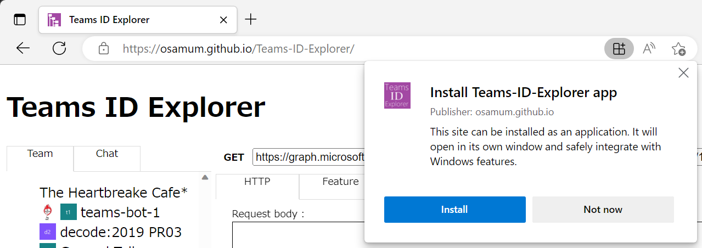

\[[日本語](#teams-id-explorer-%E3%81%AB%E3%81%A4%E3%81%84%E3%81%A6)\] /\[[English](#about-teams-id-explorer)\]

## Teams ID Explorer について

Teams ID Explorer は Microsoft Teams 用の Graph API の呼び出し結果を簡単に確認するためのツールです。

Teams ID Explorer を使用すると、[Graph Explorer](https://developer.microsoft.com/ja-jp/graph/graph-explorer) にエンドポイントを記述しなくても、GUI を使用して Microsoft Teams のリソースであるチームやチャネル、チャットに関係する Graph API の呼び出し結果を確認することができます。

また、Teams ID Explorer が API の呼び出しに使用したリクエスト URI を Graph Explorer に送ったり、API リファレンス内の該当するAPI のドキュメントに直接ジャンプして内容を確認することができます。

 

## Teams ID Explorer の利用条件

* **Microsoft Teams と Microsoft Office 365 の管理者アカウント**

    Microsoft Teams と Microsoft Office 365 の管理者権限を持つアカウントが必要です。

    お持ちでない場合は [**Microsoft 365 開発者プログラム**](https://developer.microsoft.com/microsoft-365/dev-program) に参加するなどしてアカウントと環境をご準備ください。

* **github.io に接続可能なインターネット環境**

    Teams ID Explorer は Web アプリケーションであり、Github Pages でホストされています。https://github.io に接続可能なインターネット環境をご用意ください。

* **Azure Active Directory での管理者の同意**

    Teams ID Explorer の初回ログイン時に Azure Active Directory で管理者の同意を行ってください。

    具体的な作業は、以下をご参照ください。

    * [**Teams ID Explorer の使い方 - 利用開始方法**](featureDesc-jp.md#%E5%88%A9%E7%94%A8%E9%96%8B%E5%A7%8B%E6%96%B9%E6%B3%95)

 

## Teams ID Explorer の使い方

Web ブラウザーで https://osamum.github.io/Teams-ID-Explorer/ にアクセスします。

Teams ID Explorer は Web アプリケーションですが、PWA (Progressive web apps) としてローカル環境にインストールして使用することもできます。

Web ブラウザーの言語設定が日本語 UI が、それ以外の言語の場合は英語 UI が表示されます。

利用開始方法と具体的な機能については、以下の機能説明ドキュメントをご参照ください。

* [**Teams ID Explorer の使い方**](featureDesc-jp.md)

 

---

## About Teams ID Explorer

Teams ID Explorer is a tool for easily checking the result of calling the Graph API for Microsoft Teams.

With Teams ID Explorer, you can use the GUI to check the results of calling Graph APIs related to Microsoft Teams resources such as teams, channels, and chats without writing endpoints in [Graph Explorer](https://developer.microsoft.com/ja-jp/graph/graph-explorer). 

You can also send the request URI used by the Teams ID Explorer to call the API to the Graph Explorer, or jump directly to the corresponding API's documentation in the API Reference to check its contents.

Developer tool for easy find any id of Microsoft Teams Graph API.

 

## Requirements for using Teams Identity Explorer

* Microsoft Teams and Microsoft Office 365 administrator accounts

    You must have an account with Microsoft Teams and Microsoft Office 365 admin rights.

    If you don't have one, prepare your account and environment by joining the [**Microsoft 365 Developer Program**](https://developer.microsoft.com/microsoft-365/dev-program).

* Internet environment that can connect to github.io

    Teams ID Explorer is a web application and is hosted on Github Pages. Please prepare an Internet environment that can connect to the https://github.io.

* **Admin consent in Azure Active Directory**

    Please provide admin consent in Azure Active Directory on first login to Teams Identity Explorer.

    Please refer to the following for specific work.

    * [**How to use Teams ID Explorer - How to get started**](featureDesc-en.md#how-to-get-started)

 

## How to use Teams ID Explorer

Access https://osamum.github.io/Teams-ID-Explorer/ in a web browser.

Teams ID Explorer is a web application, but can also be installed and used locally as a PWA (Progressive web app)

If the web browser's language setting is Japanese UI, otherwise the English UI is displayed.

How to start using and for specific features, please refer to the following feature description document.

* [**How to use Teams ID Explorer**](featureDesc-en.md)