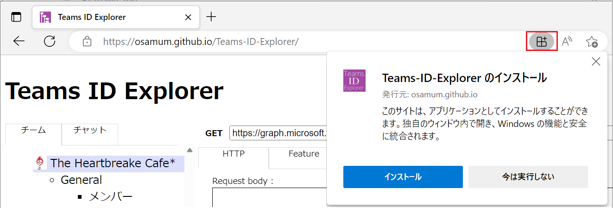

# Teams-ID-Explorer

\[日本語\]

Teams ID Explorer は Microsoft Teams 用の Graph API の呼び出し結果を簡単に確認するためのツールです。

Teams ID Explorer を使用すると、[Graph Explorer](https://developer.microsoft.com/ja-jp/graph/graph-explorer) にエンドポイントを記述しなくても、GUI を使用して Microsoft Teams のリソースであるチームやチャネル、チャットに関係する Graph API の呼び出し結果を確認することができます。

また、Teams ID Explorer が API の呼び出しに使用したリクエスト URI を Graph Explorer に送ったり、API リファレンス内の該当するAPI のドキュメントに直接ジャンプして内容を確認することができます。

 

## Teams ID Explorer の利用条件

* **Microsoft Teams と Microsoft Office 365 の管理者アカウント**

    Microsoft Teams と Microsoft Office 365 の管理者権限を持つアカウントが必要です。

    お持ちでない場合は [**Microsoft 365 開発者プログラム**](https://developer.microsoft.com/ja-JP/microsoft-365/dev-program) に参加するなどしてアカウントと環境をご準備ください。

* **github.io に接続可能なインターネット環境**

    Teams ID Explorer は Web アプリケーションであり、Github Pages でホストされています。https://github.io に接続可能なインターネット環境をご容易ください。

 

## Teams ID Explorer の使い方

Web ブラウザーで https://osamum.github.io/Teams-ID-Explorer/ にアクセスします。

　
Teams ID Explorer は Web アプリケーションですが、PWA (Progressive web apps) としてローカル環境にインストールして使用することもできます。

Web ブラウザーの言語設定が日本語 UI が、それ以外の言語の場合は英語 UI が表示されます。

具体的な機能については、以下の機能説明ドキュメントをご参照ください。

 

\[English\]

Developer tool for easy find any id of Microsoft Teams Graph API.
