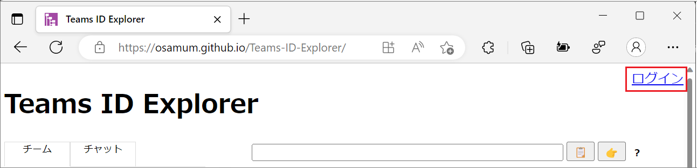
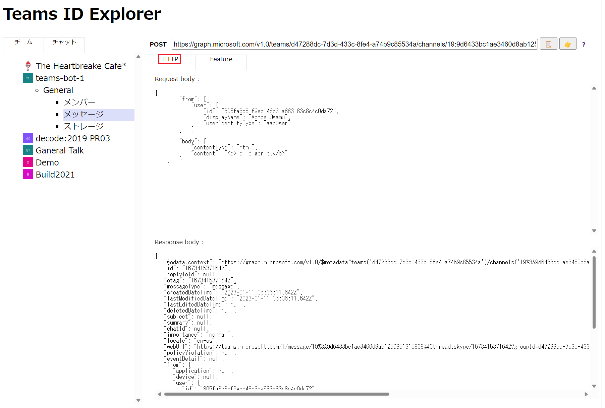
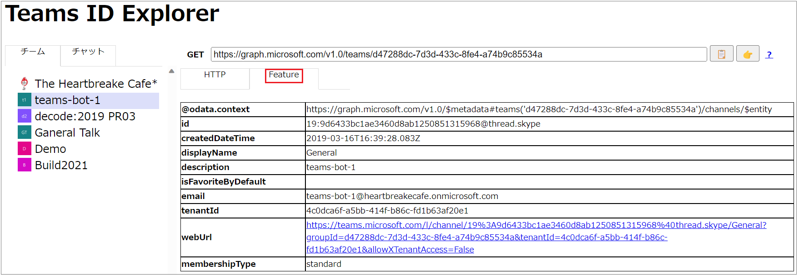
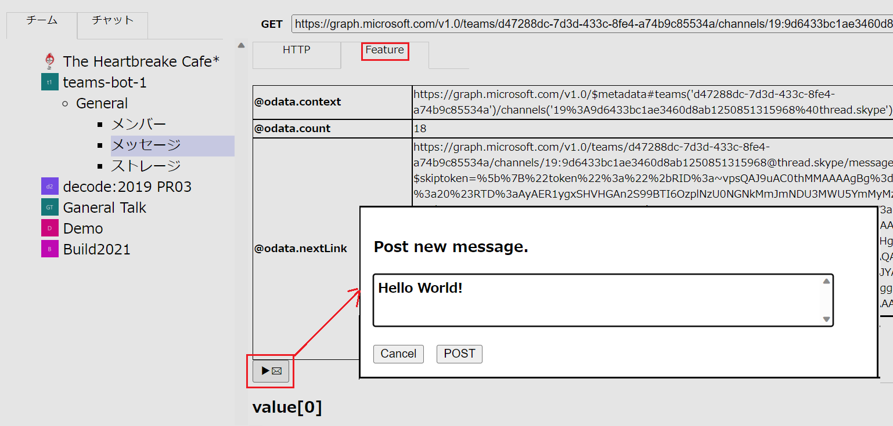

# Teams ID Explorer の使い方

Teams ID Explorer の使い方について説明します。

1. ログイン
2. アカウント情報の表示 リンク
3. チーム タブ
4. チャット タブ
5. エンドポイント バー
6. コピーボタン
7. Graph エクスプローラー ボタン
8. ドキュメント参照ボタン
9. HTTP タブ
10. Feature タブ

 

## 1. ログイン

Teams ID Explorer の使用を開始するには、[Teams ID Explorer がホストされている URL](https://osamum.github.io/Teams-ID-Explorer/) に Web ブラウザーでアクセスします。

画面に Teams ID Explorer の UI が表示されるので、画面左上の \[**ログイン**\] リンクをクリックし、Office 356 の管理者アカウントで認証を行ってください。

ログインの際、Azure Active の **アクセス許可の要求** ダイアログボックスが表示される場合は \[承諾\] ボタンをクリックしてください。

認証が正しく行われると画面に情報がロードされます。

 

以降、以下の画像を使用して説明します。

 

## 2. **アカウント情報の表示** リンク

現在のユーザーアカウントのさまざまな ID やアクセストークンを表示します。

 

## 3. **チーム** タブ

チーム、チャネルをツリー表示し、チャネルに紐づいたメンバー、メッセージ、ストレージを選択できるようにします。

 

## 4. **チャット** タブ

チャットを一覧表示し、チャットに紐づいたメンバー、メッセージを選択できるようにします。

 

## 5. エンドポイント バー

UI の操作によって呼び出された Graph API のエンドポイントと HTTP メソッドが表示されます。

 

## 6. コピーボタン

エンドポイント バーに表示されている Graph API のエンドポイントをクリップボードに送ります。

## 7. Graph エクスプローラー ボタン

エンドポイント バーに表示されている Graph API のエンドポイントを Graph Explorer に送り、新規タブで表示します。

 

## 8. ドキュメント参照ボタン

UI の操作によって呼び出された Graph API のドキュメントを新規タブで表示します。

 

## 9. HTTP タブ

実行した Graph API のリクエストボディと、レスポンスボディに含まれる JSON をそれぞれ表示します。

 

## 10. Feature タブ

Graph API が返した JSON を整形して表示します。

このタブ内の表示では、Teams の Office 365 のリソースのアクセスするための webUrl や、ストレージからファイルをダウンロードするための @microsoft.graph.downloadUrl、ミーティングに参加するための joinWebUrl 等の機能が有効に機能します。

また、メッセージを選択した際の \[**Feature**\] タブでは新規のメッセージを投稿することができます。

その他、\[**Feature**\] タブに表示されるリンクの機能はここで紹介するものが全てではなく、さまざまな機能が割り振られているので実際にクリックして確認してください。

 

---
🏠 [**Readme に戻る**](README.md)

