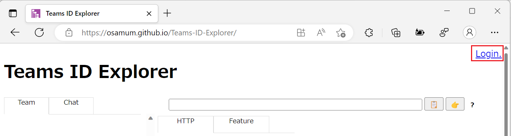
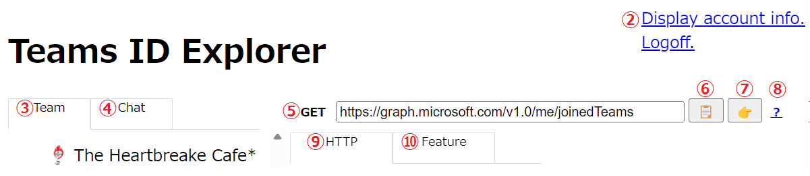
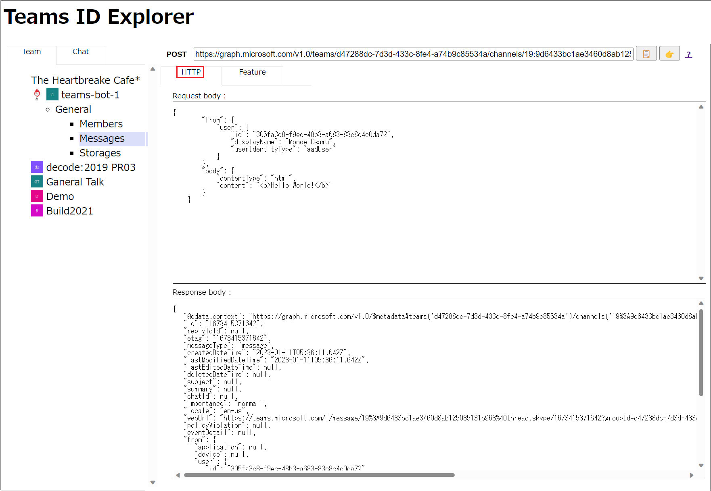
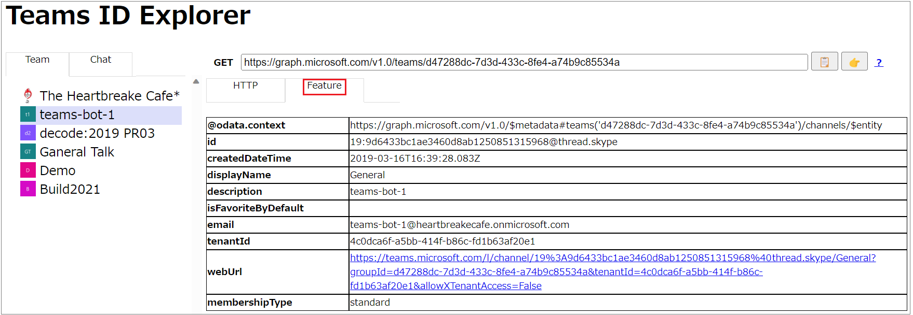
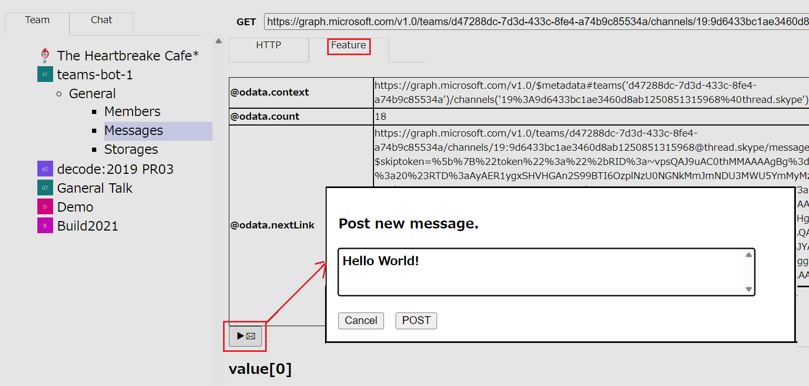
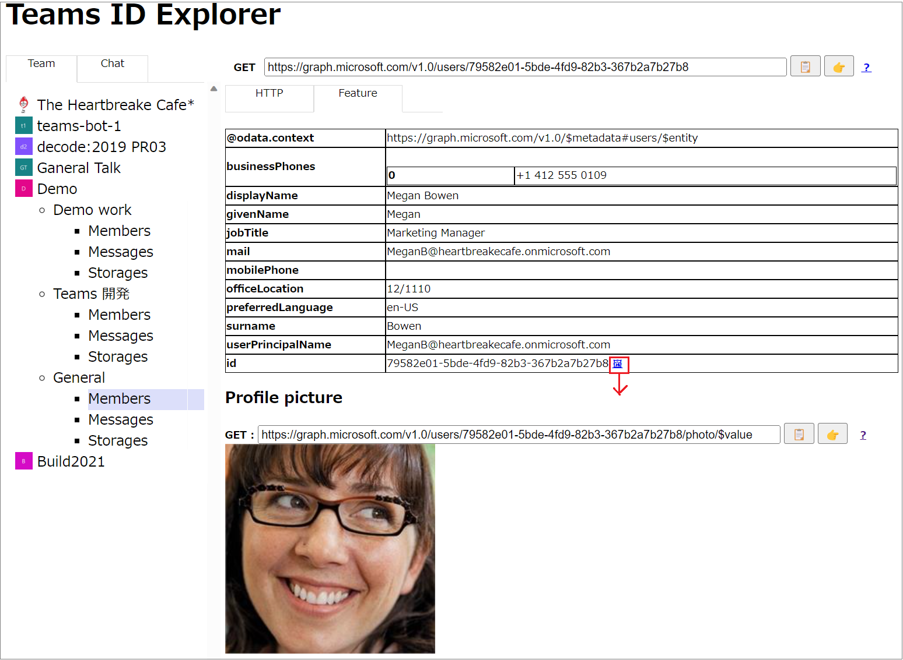

# How to use Teams ID Explorer

Learn how to use Teams ID Explorer.

1. [login](#1-%E3%83%AD%E3%82%B0%E3%82%A4%E3%83%B3)
2. [**View account information** link](#-%E3%82%A2%E3%82%AB%E3%82%A6%E3%83%B3%E3%83%88%E6%83%85%E5%A0%B1%E3%81%AE%E8%A1%A8%E7%A4%BA-%E3%83%AA%E3%83%B3%E3%82%AF)
3. [\[**Team**\] tab](#-%E3%83%81%E3%83%BC%E3%83%A0-%E3%82%BF%E3%83%96)
4. [\[**Chat**\] tab](#-%E3%83%81%E3%83%A3%E3%83%83%E3%83%88-%E3%82%BF%E3%83%96)
5. [Endpoint bar](#-%E3%82%A8%E3%83%B3%E3%83%89%E3%83%9D%E3%82%A4%E3%83%B3%E3%83%88-%E3%83%90%E3%83%BC)
6. [Copy button](#-%E3%82%B3%E3%83%94%E3%83%BC%E3%83%9C%E3%82%BF%E3%83%B3)
7. [Graph Explorer button](#-graph-%E3%82%A8%E3%82%AF%E3%82%B9%E3%83%97%E3%83%AD%E3%83%BC%E3%83%A9%E3%83%BC-%E3%83%9C%E3%82%BF%E3%83%B3)
8. [Document browse button](#-%E3%83%89%E3%82%AD%E3%83%A5%E3%83%A1%E3%83%B3%E3%83%88%E5%8F%82%E7%85%A7%E3%83%9C%E3%82%BF%E3%83%B3)
9. [\[**HTTP**\] tab](#-http-%E3%82%BF%E3%83%96)
10. [\[**Feature**\] tab](#-feature-%E3%82%BF%E3%83%96)

 

## 1. Login

To get started with Teams ID Explorer, go to [the URL where Teams ID Explorer is hosted](https://osamum.github.io/Teams-ID-Explorer/)  in a web browser.

When the Teams identity explorer UI appears on the screen, click the \[**Login**\] link in the upper left corner of the screen to authenticate with your Office 356 administrator account.

When the Teams identity explorer UI appears on the screen, click the Login link in the upper left corner of the screen to authenticate with your Office 356 administrator account.

When logging in, if the Azure Active Directory \[Request Permissions\] dialog box appears, click the \[Accept\] button.

If authentication is successful, the screen is loaded with information.

 

From here, I will use the image below to explain.

 

## ② **View account information** link

View various IDs and access tokens for the current user account.

 

## ③ \[**Team**\] tab

Displays a tree view of teams and channels, allowing you to select members, messages, and storage associated with channels.

 

## ④ \[**Chat**\] tab

Lists chats and allows you to select members and messages associated with chats.

 

## ➄ Endpoint bar

Displays the Graph API endpoints and HTTP methods invoked by UI interactions.

 

## ⑥ Copy button

Sends the Graph API endpoint displayed in the endpoint bar to the clipboard.

 

## ➆ Graph Explorer button

Sends the Graph API endpoint displayed in the endpoint bar to Graph Explorer and displays it in a new tab.

 

## ⑧ Document browse button

Displays the documentation for the Graph API called by UI manipulation in a new tab.

 

## ➈ \[HTTP\] tab

Displays the request body of the executed Graph API and the JSON contained in the response body, respectively.

 

## ➉ \[Feature\] tab

Format and display the JSON returned by the Graph API.

Within this tab, features such as webUrls to access Office 365 resources in Teams, @microsoft.graph.downloadUrls to download files from storage, and joinWebUrls to join meetings work effectively.

You can also post a new message on the \[**Feature**\] tab when you select a message.

In addition, the functions of the links displayed on the \[**Feature**\] tab are not all those introduced here, and various functions are assigned, so click on them to check them out.

 

---
🏠 [**Back to Readme**](README.md)

